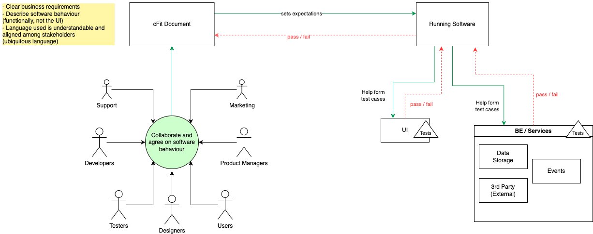

# Fitogether

Inspired by the workflow of [_Fit_](http://fit.c2.com/), Fitogether enables collaboration and communication in software development.

## Concept

Multiple stakeholders (technical and non-technical) collaborate together to produce a cFit Document that describes the software behaviour in a language that is understandable and clear to all. This document should be easy enough to understand that it can serve as a manual to ordinary users, a promise to your users of what the software does.

The cFit Document feeds into the process of developing the running software. Each part of the document sets an expectation of how the software should behave, like an acceptance criteria, which is then translated into one or more tests written as part of the UI or service's test. Typically a UI or a service has different granularity of tests (testing pyramid), therefore, the one expectation could encompass a few unit tests, a few component tests and an integration test.

All the tests results then feeds back up and collated to indicate if the expectation in the Fit Document has been met or not.

A cFit report should show:

* the expectations of the software
* if the expectations of the software has been met. This is measured if all tests related to that expectation pass.
* a breakdown of where the expectation is verified. This is the list of where the tests are.

